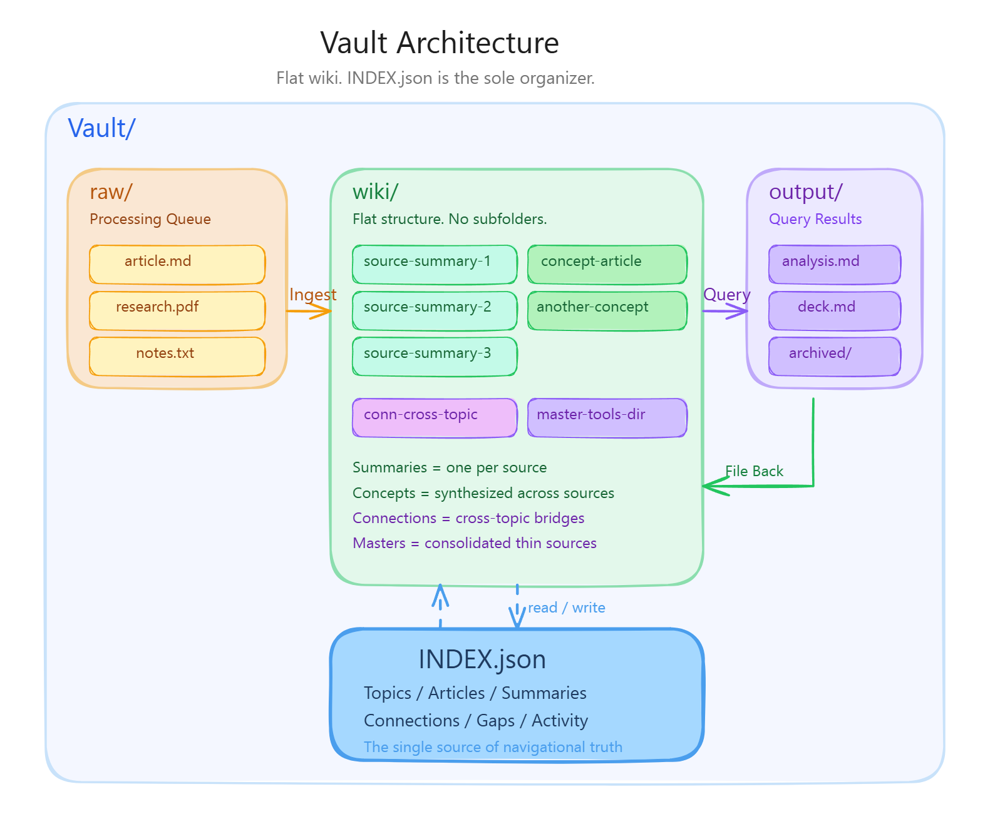

# claude-fast-wiki

You read articles, watch videos, collect bookmarks, save PDFs. Months later, you can't find any of it. The knowledge you consumed didn't compound. It scattered.

This is an AI-maintained knowledge base for [Claude Code](https://docs.anthropic.com/en/docs/claude-code). You drop source material into a folder. The AI processes it into structured summaries, synthesizes articles that connect ideas across sources, and maintains a searchable index. You ask questions in plain English. The best answers get saved back into the wiki as permanent knowledge. Every cycle makes the system smarter.

Based on [Andrej Karpathy's method](https://x.com/karpathy/status/2039805659525644595) for LLM knowledge bases ([gist](https://gist.github.com/karpathy/442a6bf555914893e9891c11519de94f)), extended with flat-file architecture, a navigational index, temporal awareness, and a 5-protocol workflow system.

<p align="center"><a href="diagrams/vault-architecture.png"></a></p>

## Getting Started

**Requirements:** [Claude Code](https://docs.anthropic.com/en/docs/claude-code) (the AI that runs your wiki) and [Obsidian](https://obsidian.md) (free app to browse your wiki with graph view, backlinks, and search).

### Option A: Let Claude set it up for you (recommended)

1. Download [`wiki.md`](.claude/commands/wiki.md) from this repo
2. Save it to `.claude/commands/wiki.md` inside your project folder (create the folders if they don't exist)
3. Open Claude Code in your project and say:

```
/wiki set up my knowledge base
```

Claude handles the rest. It will pull the necessary files from this repo, create your vault folders, and tell you when it's ready.

### Option B: Set it up yourself

```bash
# 1. Clone this repo somewhere on your machine
git clone https://github.com/Abdo-El-Mobayad/claude-fast-wiki.git

# 2. Go to your project folder and copy two things:
#    The .claude folder (command + skill)
cp -r claude-fast-wiki/.claude your-project/.claude

#    The vault (where your knowledge lives)
cp -r claude-fast-wiki/vault-template your-project/Vault
```

After either option, everything is `/wiki` from here on.

### What goes where

This system has three pieces. Here's where each one lands in your project:

```
your-project/
├── .claude/                          <-- Copied directly from this repo
│   ├── commands/
│   │   └── wiki.md                   <-- The command. Type /wiki to talk to your KB.
│   └── skills/
│       └── wiki/                     <-- The skill. AI reads these files to know
│           ├── SKILL.md                  how to run your wiki. You never touch these.
│           ├── protocols/
│           ├── templates/
│           └── references/
└── Vault/                            <-- Your knowledge base. This is where your
    ├── raw/                              content lives. Open this folder in Obsidian.
    ├── wiki/
    ├── output/
    └── INDEX.json
```

**The command** (`wiki.md`) is what you interact with. Type `/wiki` followed by what you need.

**The skill** (the `wiki/` folder inside `.claude/skills/`) is the AI's instruction manual. It contains the protocols, templates, and references that tell Claude how to process your sources, build articles, answer questions, and maintain the wiki. You never need to read or edit these files.

**The vault** (`Vault/`) is your actual knowledge base. This is the only part you interact with directly (by dropping files into `raw/` and browsing the wiki in Obsidian).

### Start using it

Drop `.md`, `.html`, `.txt`, or `.pdf` files into `Vault/raw/`, then:

```
/wiki process the new stuff
```

The AI reads each source, creates structured summaries, extracts key concepts, updates the index, and cleans up the raw files. Your knowledge base is live.

### Git and version control

Add this to your `.gitignore` if you don't want to track raw source files (they get deleted after processing anyway):

```
Vault/raw/*
!Vault/raw/.gitkeep
```

The `Vault/wiki/` and `Vault/INDEX.json` are worth tracking in git. They are your compiled knowledge and benefit from version history.

## The Five Protocols

The system routes your natural language to five specialized protocols. You never need to remember which one to call. Just talk.

| Protocol      | What It Does                                                                                   | You Say                                                     |
| ------------- | ---------------------------------------------------------------------------------------------- | ----------------------------------------------------------- |
| **Ingest**    | Processes raw sources into structured wiki summaries with key concepts and citations           | "Process the new stuff" / "I dropped some articles in raw/" |
| **Compile**   | Synthesizes concept articles from summaries, builds cross-links, identifies gaps               | "Organize the wiki" / "What connections are we missing?"    |
| **Query**     | Researches your wiki and produces structured answers at 3 depth tiers                          | "What do we know about X?" / "Deep dive on Y"               |
| **Lint**      | Audits wiki health: orphans, broken links, stale content, thin articles, evolution suggestions | "How healthy is the wiki?" / "Find gaps and fix them"       |
| **File Back** | Promotes valuable query outputs into permanent wiki articles                                   | "Save that answer" / "Keep that"                            |

### Query Depth (Auto-Detected)

You don't pick a depth. The AI figures it out from how you phrase the question.

| Tier         | Signals                                                 | What Happens                                                           |
| ------------ | ------------------------------------------------------- | ---------------------------------------------------------------------- |
| **Quick**    | "How many topics?", "What do we have on X?"             | Reads INDEX.json only. Answers inline.                                 |
| **Standard** | "Tell me about X", "Compare X and Y"                    | Reads relevant articles. Writes output to `Vault/output/`.             |
| **Deep**     | "Deep dive", "Comprehensive analysis", "Write a report" | Multi-agent research across the full wiki. Fills gaps with web search. |

## Why INDEX.json

The index is the most important design decision in this system. It's JSON, not markdown, and that's deliberate.

### You can query it without reading all of it

A markdown index forces you to load the entire file to find anything. JSON lets you extract exactly what you need:

```bash
# Just the meta stats (~30 tokens)
cat Vault/INDEX.json | jq '.meta'

# Just one topic's articles (~1-3K tokens)
cat Vault/INDEX.json | jq '.topics["ai-agents"]'

# Search by keyword across all articles
cat Vault/INDEX.json | jq '[.topics[].articles[] | select(.title | test("keyword"; "i"))]'
```

Even when your index grows to 50K+ tokens, you never need to load all of it. You pull the slice you need and move on. This is the difference between a file you read and a file you query.

### Sub-agent delegation keeps your main thread lean

When you're doing knowledge work, your main conversation runs on a powerful model (like Opus). Loading a large index into that context window is expensive and wastes capacity you need for the actual thinking.

Instead, the main thread delegates index scanning to a cheaper, faster sub-agent (Sonnet or Haiku). The sub-agent loads the index, finds the relevant articles, and reports back with just the file paths. The main thread then reads only those specific wiki files.

This does two things:

1. **Reduces cost.** The index scan runs on a cheaper model. Your expensive main thread only reads the articles it actually needs.
2. **Keeps the main thread focused.** Instead of 50K tokens of index occupying your context window, you get back a short list of recommended files. More room for the knowledge work you're actually doing.

### It scales naturally

| Wiki Size             | INDEX.json    | How the AI reads it                                             |
| --------------------- | ------------- | --------------------------------------------------------------- |
| Small (< 50 articles) | < 10K tokens  | Reads the whole thing directly. No sub-agent needed.            |
| Medium (50-200)       | 10-50K tokens | Queries specific topics via `jq` or Python.                     |
| Large (200+)          | 50K+ tokens   | Delegates to a sub-agent. Main thread never sees the raw index. |

You don't need to change anything as your wiki grows. The same INDEX.json works at every scale. The AI just reads less of it at a time.

## How It Works Under the Hood

**Flat wiki, no subfolders.** All files live directly in `wiki/`. Topics and connections are tracked in INDEX.json, not folder paths. This makes it easy for the AI to find everything with a single index read.

**Summaries vs. concept articles.** When you drop in a source, the AI creates a summary (one per source, preserving the original's claims and data). When you ask it to organize, it creates concept articles that synthesize ideas across multiple summaries. This separation means it can see patterns across ALL your sources before deciding what deserves its own article.

**Raw is a processing queue.** Source files are deleted from `raw/` after processing. The wiki summary becomes the permanent record. The original URL is saved in the summary's metadata for reference.

**Three dates per file.** Each wiki file tracks when the original source was published, when it was processed, and when it was last updated. This lets the AI know when information is getting stale.

**Relevance decay.** Each topic can have a freshness threshold (default: 180 days, AI topics: 90 days). When you ask questions, the AI prefers recent sources and warns you when content is getting old.

**Wikilinks everywhere.** All internal references use `[[wikilinks]]` so Obsidian can show you the graph view, backlinks, and auto-update links when files move.

## Using /wiki

Once set up, `/wiki` is your single interface. Just talk:

```
/wiki                                    --> Show status (topics, articles, health)
/wiki process the new stuff              --> Ingest raw/ into wiki/
/wiki organize the wiki                  --> Compile concept articles + cross-links
/wiki what do we know about [topic]?     --> Query (auto-detects depth)
/wiki deep dive on [topic]               --> Deep multi-agent research
/wiki write me a presentation on [topic] --> Generates Marp slide deck
/wiki show me a knowledge map            --> Generates Obsidian canvas
/wiki how healthy is the wiki?           --> Full health audit
/wiki find gaps and fix them             --> Lint with auto-fix
/wiki save that last answer              --> File back into wiki
/wiki compare X and Y                    --> Standard query with structured output
```

## Output Formats

Queries produce markdown by default, but the system also supports:

| Format          | Signal                                   | Output                                                 |
| --------------- | ---------------------------------------- | ------------------------------------------------------ |
| **Markdown**    | Default                                  | `.md` file in `output/`                                |
| **Marp Slides** | "presentation", "slides", "deck"         | `.md` with Marp frontmatter, viewable with Marp plugin |
| **Canvas Map**  | "visual map", "knowledge map", "diagram" | `.canvas` file, renders natively in Obsidian           |

## Obsidian Integration

The wiki is designed to work beautifully in [Obsidian](https://obsidian.md):

- **Graph View** shows how articles connect through wikilinks
- **Backlinks Panel** reveals which sources reference each concept
- **Search** finds content across all wiki files instantly
- **Canvas** renders knowledge maps generated by the query protocol
- **Marp Slides** plugin renders presentation decks
- **CLI** (Obsidian 1.12+) enables faster search and structural analysis from Claude Code

Open your `Vault/` folder as an Obsidian vault. Everything just works.

## Advanced Topics

### Thin Sources and Master Directories

Not every source deserves its own file. Tool URLs, GitHub repos, and bookmark-style links go into consolidated master directory files:

- `wiki/master-tools-directory.md` for product/tool URLs
- `wiki/master-github-repos.md` for repository links

This prevents hundreds of one-paragraph files from cluttering the wiki.

### HTML and PDF Companions

Non-markdown files get a companion `.md` file with metadata and extracted insights. The original file is kept unchanged. The companion makes non-markdown content searchable through the same index.

### Connection Articles

When concepts bridge two or more topics, the compile protocol creates connection articles prefixed with `conn-`. These link to relevant articles in both topics and appear in INDEX.json's `connections` array.

## What's Different From Karpathy's Original

Andrej Karpathy described the core loop: raw sources go in, LLM compiles a wiki, you query it, knowledge compounds. This implementation extends it with:

1. **Queryable JSON index** instead of markdown. Extract specific topics, search by keyword, filter by concept without loading the whole file.
2. **Sub-agent delegation** for index scanning. Main thread stays lean, cheaper models read the index, only recommended files enter your context.
3. **Five distinct protocols** (ingest, compile, query, lint, file-back) with clear separation of concerns
4. **Temporal awareness** with per-topic relevance decay and staleness detection
5. **Three-tier query depth** that auto-detects from your question's complexity
6. **Structured metadata** with three dates per file for precise temporal tracking
7. **Master directories** for thin sources to prevent wiki bloat
8. **Connection articles** for explicit cross-topic synthesis
9. **Lint protocol** with auto-fix for self-healing wiki maintenance
10. **Multiple output formats** including Marp presentations and Obsidian canvas maps
11. **Obsidian CLI integration** for high-performance structural analysis

## Repo Structure

```
claude-fast-wiki/
├── README.md                           # You're here
├── LICENSE                             # MIT
├── .claude/                            # Copy this entire folder to your project
│   ├── commands/
│   │   └── wiki.md                     #   The /wiki command you interact with
│   └── skills/
│       └── wiki/                       #   The AI's instruction manual
│           ├── SKILL.md                #     Main definition + intent routing
│           ├── protocols/              #     How to run each workflow
│           │   ├── ingest.md           #       Raw sources -> wiki summaries
│           │   ├── compile.md          #       Summaries -> concept articles
│           │   ├── query.md            #       3-tier question answering
│           │   ├── lint.md             #       Health audit + auto-fix
│           │   └── file-back.md        #       Output -> permanent wiki
│           ├── templates/              #     Schemas for wiki files
│           │   ├── source-summary.md   #       Summary format
│           │   ├── wiki-article.md     #       Concept article format
│           │   ├── index-format.md     #       INDEX.json schema + queries
│           │   └── marp-deck.md        #       Slide deck format
│           └── references/             #     Tool references
│               ├── obsidian-cli-ref.md #       Obsidian CLI commands
│               └── canvas-spec.md      #       JSON Canvas format
├── diagrams/                           # Architecture diagram
└── vault-template/                     # Copy to Vault/ in your project
    ├── INDEX.json                      #   Empty initialized index
    ├── raw/                            #   Source drop zone
    ├── wiki/                           #   AI-maintained wiki
    └── output/archived/                #   Query output staging
```

## Credits

Inspired by [Andrej Karpathy's LLM knowledge base tweet](https://x.com/karpathy/status/2039805659525644595) and [gist](https://gist.github.com/karpathy/442a6bf555914893e9891c11519de94f). Built for [Claude Code](https://docs.anthropic.com/en/docs/claude-code) as part of the [ClaudeFast](https://claudefa.st) ecosystem.

## License

MIT
