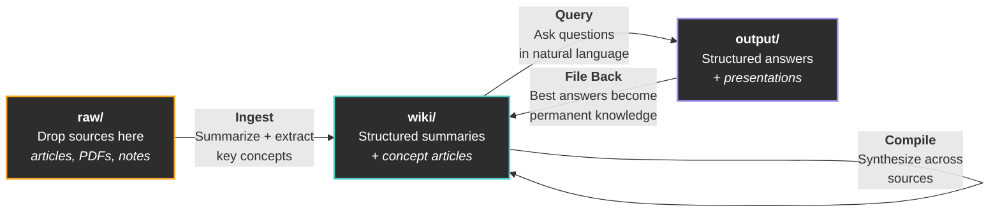
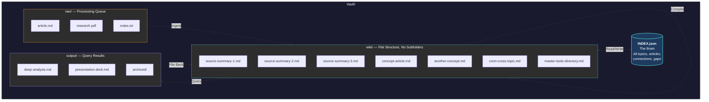

# claude-fast-wiki

You read articles, watch videos, collect bookmarks, save PDFs. Months later, you can't find any of it. The knowledge you consumed didn't compound. It scattered.

This is an LLM-maintained knowledge base for [Claude Code](https://docs.anthropic.com/en/docs/claude-code). You drop source material into a folder. The AI processes it into structured wiki summaries, synthesizes concept articles across sources, and maintains a searchable index. You ask questions in natural language. The best answers file back into the wiki as permanent knowledge. Every cycle makes the system smarter.

Based on [Andrej Karpathy's method](https://x.com/karpaborern/status/1907518672339382448) for LLM knowledge bases, extended with flat-file architecture, a navigational index, temporal awareness, and a 5-protocol workflow system.



## Getting Started

You need [Claude Code](https://docs.anthropic.com/en/docs/claude-code) and [Obsidian](https://obsidian.md) (free, for browsing your wiki with graph view, backlinks, and search).

### 1. Copy the skill and command into your project

```bash
# Clone this repo (or download it)
git clone https://github.com/Abdo-El-Mobayad/claude-fast-wiki.git

# Copy the skill into your project's .claude folder
cp -r claude-fast-wiki/skill/ your-project/.claude/skills/wiki/

# Copy the /wiki command
cp -r claude-fast-wiki/command/wiki.md your-project/.claude/commands/wiki.md

# Copy the vault template
cp -r claude-fast-wiki/vault-template/ your-project/Vault/
```

### 2. Open Claude Code and start

```
/wiki set up the knowledge base
```

If you already copied the vault template, it'll detect the structure and report ready. If not, it creates the folders and empty INDEX.json for you.

### 3. Drop sources and go

Drop `.md`, `.html`, `.txt`, or `.pdf` files into `Vault/raw/`, then:

```
/wiki process the new stuff
```

That's it. The AI reads each source, creates structured summaries, extracts key concepts, updates the index, and cleans up the raw files. Your knowledge base is live.

## The Five Protocols

The system routes your natural language to five specialized protocols. You never need to remember which one to call. Just talk.

| Protocol      | What It Does                                                                                       | You Say                                                     |
| ------------- | -------------------------------------------------------------------------------------------------- | ----------------------------------------------------------- |
| **Ingest**    | Processes raw sources into structured wiki summaries with frontmatter, key concepts, and citations | "Process the new stuff" / "I dropped some articles in raw/" |
| **Compile**   | Synthesizes concept articles from summaries, builds cross-links, identifies gaps                   | "Organize the wiki" / "What connections are we missing?"    |
| **Query**     | Researches your wiki and produces structured answers at 3 depth tiers                              | "What do we know about X?" / "Deep dive on Y"               |
| **Lint**      | Audits wiki health: orphans, broken links, stale content, thin articles, evolution suggestions     | "How healthy is the wiki?" / "Find gaps and fix them"       |
| **File Back** | Promotes valuable query outputs into permanent wiki articles                                       | "Save that answer" / "Keep that"                            |

### Query Depth (Auto-Detected)

| Tier         | Signals                                                 | What Happens                                                           |
| ------------ | ------------------------------------------------------- | ---------------------------------------------------------------------- |
| **Quick**    | "How many topics?", "What do we have on X?"             | Reads INDEX.json only. Answers inline.                                 |
| **Standard** | "Tell me about X", "Compare X and Y"                    | Reads relevant articles. Writes output to `Vault/output/`.             |
| **Deep**     | "Deep dive", "Comprehensive analysis", "Write a report" | Multi-agent research across the full wiki. Fills gaps with web search. |

## Architecture



### Key Design Decisions

**Flat wiki, no subfolders.** All files live directly in `wiki/`. Topics, article types, and connections are tracked in INDEX.json metadata, not folder paths. This optimizes for LLM navigation: one index read tells the AI where everything is.

**INDEX.json is the brain.** A single JSON file that maps every topic, article, summary, connection, and gap. It's a compiled cache that can be regenerated from file frontmatter at any time. At small scale, the AI reads it in full. At large scale (100+ articles), it queries specific slices via `jq` or Python.

**Summaries vs. concept articles.** Ingest creates summaries (one per source, preserving the original's claims and data). Compile creates concept articles (synthesizing across multiple sources). This separation means compile can see patterns across ALL sources before deciding what deserves its own article.

**Raw is a processing queue.** Source files are deleted from `raw/` after successful ingest. The wiki summary becomes the permanent record. The original URL is preserved in `source_url` frontmatter for provenance.

**Three dates per file.** `date_published` (original source), `date_ingested` (when processed), `date_updated` (last modified). Never rely on filesystem timestamps. Git and sync tools break them.

**Relevance decay.** Each topic can set `relevance_decay_days` (default 180, fast-moving fields like AI: 90). During queries, the AI prefers recent sources and flags stale content. Your wiki tells you when it's getting old.

**Wikilinks everywhere.** All internal references use `[[wikilinks]]` for Obsidian compatibility. This enables graph view, backlinks panel, and automatic link updates when files are moved.

## Vault Structure

```
Vault/
├── raw/                    # Drop sources here. Cleared after ingest.
│   └── assets/             # Images referenced by sources (permanent)
├── wiki/                   # All wiki content. Flat, no subfolders.
│   ├── [source-summaries]  # One per ingested source
│   ├── [concept-articles]  # Synthesized from multiple summaries
│   ├── [conn-* articles]   # Cross-topic connection articles
│   └── [master-* dirs]     # Consolidated directories for thin sources
├── output/                 # Query results staged here
│   └── archived/           # Processed outputs
└── INDEX.json              # The navigational brain
```

## Using /wiki

Once set up, `/wiki` is your single interface. Just talk:

```
/wiki                                    --> Show status (topics, articles, health)
/wiki process the new stuff              --> Ingest raw/ into wiki/
/wiki organize the wiki                  --> Compile concept articles + cross-links
/wiki what do we know about [topic]?     --> Query (auto-detects depth)
/wiki deep dive on [topic]               --> Deep multi-agent research
/wiki write me a presentation on [topic] --> Generates Marp slide deck
/wiki show me a knowledge map            --> Generates Obsidian canvas
/wiki how healthy is the wiki?           --> Full health audit
/wiki find gaps and fix them             --> Lint with auto-fix
/wiki save that last answer              --> File back into wiki
/wiki compare X and Y                    --> Standard query with structured output
```

## Output Formats

Queries produce markdown by default, but the system also supports:

| Format          | Signal                                   | Output                                                 |
| --------------- | ---------------------------------------- | ------------------------------------------------------ |
| **Markdown**    | Default                                  | `.md` file in `output/`                                |
| **Marp Slides** | "presentation", "slides", "deck"         | `.md` with Marp frontmatter, viewable with Marp plugin |
| **Canvas Map**  | "visual map", "knowledge map", "diagram" | `.canvas` file, renders natively in Obsidian           |

## Obsidian Integration

The wiki is designed to work beautifully in [Obsidian](https://obsidian.md):

- **Graph View** shows how articles connect through wikilinks
- **Backlinks Panel** reveals which sources reference each concept
- **Search** finds content across all wiki files instantly
- **Canvas** renders knowledge maps generated by the query protocol
- **Marp Slides** plugin renders presentation decks
- **CLI** (Obsidian 1.12+) enables 54x faster orphan detection and 6x faster search from Claude Code

Open your `Vault/` folder as an Obsidian vault. Everything just works.

## Advanced Topics

### Thin Sources and Master Directories

Not every source deserves its own file. Tool URLs, GitHub repos, and bookmark-style links go into consolidated master directory files:

- `wiki/master-tools-directory.md` for product/tool URLs
- `wiki/master-github-repos.md` for repository links

This prevents hundreds of one-paragraph files from cluttering the wiki.

### HTML and PDF Companions

Non-markdown files get a companion `.md` file with frontmatter and extracted insights. The original file is kept unchanged. The companion makes non-markdown content queryable and linkable through the same index.

### Connection Articles

When concepts bridge two or more topics, the compile protocol creates connection articles prefixed with `conn-`. These appear in INDEX.json's `connections` array and link to relevant articles in both topics.

### Scaling INDEX.json

At small scale (under 50 articles), INDEX.json is read in full. As the wiki grows:

| Scale                 | INDEX.json Size | Strategy                                       |
| --------------------- | --------------- | ---------------------------------------------- |
| Small (< 50 articles) | < 10K tokens    | Read in full                                   |
| Medium (50-200)       | 10-50K tokens   | Query specific topics via jq/Python            |
| Large (200+)          | 50K+ tokens     | Never read in full. Use targeted queries only. |

The skill includes a full jq query reference for navigating large indexes efficiently.

## What's Different From Karpathy's Original

Andrej Karpathy described the core loop: raw sources go in, LLM compiles a wiki, you query it, knowledge compounds. This implementation extends it with:

1. **INDEX.json as the sole organizer** instead of folder-based topic separation
2. **Five distinct protocols** (ingest, compile, query, lint, file-back) with clear separation of concerns
3. **Temporal awareness** with per-topic relevance decay and staleness detection
4. **Three-tier query depth** that auto-detects from your question's complexity
5. **Structured frontmatter** with three dates per file for precise temporal tracking
6. **Master directories** for thin sources to prevent wiki bloat
7. **Connection articles** for explicit cross-topic synthesis
8. **Lint protocol** with auto-fix for self-healing wiki maintenance
9. **Multiple output formats** including Marp presentations and Obsidian canvas maps
10. **Obsidian CLI integration** for high-performance structural analysis

## Repo Structure

```
claude-fast-wiki/
├── README.md                           # You're here
├── LICENSE                             # MIT
├── skill/                              # Copy to .claude/skills/wiki/
│   ├── SKILL.md                        # Main skill definition + intent routing
│   ├── protocols/
│   │   ├── ingest.md                   # Raw sources -> wiki summaries
│   │   ├── compile.md                  # Summaries -> concept articles
│   │   ├── query.md                    # 3-tier question answering
│   │   ├── lint.md                     # Health audit + auto-fix
│   │   └── file-back.md               # Output -> permanent wiki
│   ├── templates/
│   │   ├── source-summary.md           # Frontmatter schema for summaries
│   │   ├── wiki-article.md             # Frontmatter schema for articles
│   │   ├── index-format.md             # INDEX.json schema + jq queries
│   │   └── marp-deck.md               # Marp slide deck reference
│   └── references/
│       ├── obsidian-cli-ref.md         # Obsidian CLI commands
│       └── canvas-spec.md             # JSON Canvas format spec
├── command/
│   └── wiki.md                         # Copy to .claude/commands/wiki.md
└── vault-template/                     # Copy to Vault/ in your project
    ├── INDEX.json                      # Empty initialized index
    ├── raw/                            # Source drop zone
    ├── wiki/                           # AI-maintained wiki
    └── output/archived/                # Query output staging
```

## Credits

Inspired by [Andrej Karpathy's tweet](https://x.com/karpaborern/status/1907518672339382448) on LLM knowledge bases. Built for [Claude Code](https://docs.anthropic.com/en/docs/claude-code) by [Abdo El-Mobayad](https://x.com/AEMobayad).

Part of the [ClaudeFast](https://claudefa.st) ecosystem.

## License

MIT
