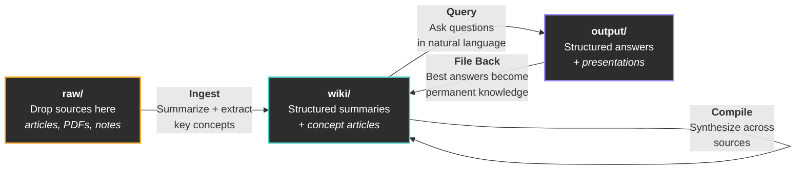
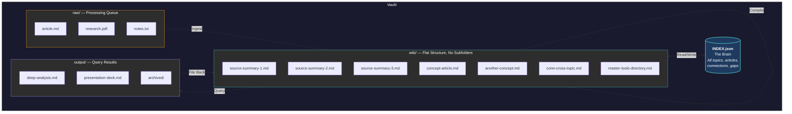

# claude-fast-wiki

You read articles, watch videos, collect bookmarks, save PDFs. Months later, you can't find any of it. The knowledge you consumed didn't compound. It scattered.

This is an AI-maintained knowledge base for [Claude Code](https://docs.anthropic.com/en/docs/claude-code). You drop source material into a folder. The AI processes it into structured summaries, synthesizes articles that connect ideas across sources, and maintains a searchable index. You ask questions in plain English. The best answers get saved back into the wiki as permanent knowledge. Every cycle makes the system smarter.

Based on [Andrej Karpathy's method](https://x.com/karpathy/status/2039805659525644595) for LLM knowledge bases ([gist](https://gist.github.com/karpathy/442a6bf555914893e9891c11519de94f)), extended with flat-file architecture, a navigational index, temporal awareness, and a 5-protocol workflow system.



## Getting Started

**Requirements:** [Claude Code](https://docs.anthropic.com/en/docs/claude-code) (the AI that runs your wiki) and [Obsidian](https://obsidian.md) (free app to browse your wiki with graph view, backlinks, and search).

### Option A: Let Claude set it up for you (recommended)

1. Download [`wiki.md`](command/wiki.md) from this repo
2. Save it to `.claude/commands/wiki.md` inside your project folder (create the folders if they don't exist)
3. Open Claude Code in your project and say:

```
/wiki set up my knowledge base
```

Claude handles the rest. It will pull the necessary files from this repo, create your vault folders, and tell you when it's ready.

### Option B: Set it up yourself

```bash
# 1. Clone this repo somewhere on your machine
git clone https://github.com/Abdo-El-Mobayad/claude-fast-wiki.git

# 2. Go to your project folder and copy three things:
#    The command (how you talk to the wiki)
mkdir -p your-project/.claude/commands
cp claude-fast-wiki/command/wiki.md your-project/.claude/commands/wiki.md

#    The skill (how the AI knows what to do)
cp -r claude-fast-wiki/skill your-project/.claude/skills/wiki

#    The vault (where your knowledge lives)
cp -r claude-fast-wiki/vault-template your-project/Vault
```

After either option, everything is `/wiki` from here on.

### What goes where

This system has three pieces. Here's where each one lands in your project:

```
your-project/
├── .claude/
│   ├── commands/
│   │   └── wiki.md           <-- The command. Type /wiki to talk to your KB.
│   └── skills/
│       └── wiki/             <-- The skill. AI reads these files to know
│           ├── SKILL.md          how to run your wiki. You never touch these.
│           ├── protocols/
│           ├── templates/
│           └── references/
└── Vault/                    <-- Your knowledge base. This is where your
    ├── raw/                      content lives. Open this folder in Obsidian.
    ├── wiki/
    ├── output/
    └── INDEX.json
```

**The command** (`wiki.md`) is what you interact with. Type `/wiki` followed by what you need.

**The skill** (the `wiki/` folder inside `.claude/skills/`) is the AI's instruction manual. It contains the protocols, templates, and references that tell Claude how to process your sources, build articles, answer questions, and maintain the wiki. You never need to read or edit these files.

**The vault** (`Vault/`) is your actual knowledge base. This is the only part you interact with directly (by dropping files into `raw/` and browsing the wiki in Obsidian).

### Start using it

Drop `.md`, `.html`, `.txt`, or `.pdf` files into `Vault/raw/`, then:

```
/wiki process the new stuff
```

The AI reads each source, creates structured summaries, extracts key concepts, updates the index, and cleans up the raw files. Your knowledge base is live.

### Git and version control

Add this to your `.gitignore` if you don't want to track raw source files (they get deleted after processing anyway):

```
Vault/raw/*
!Vault/raw/.gitkeep
```

The `Vault/wiki/` and `Vault/INDEX.json` are worth tracking in git. They are your compiled knowledge and benefit from version history.

## The Five Protocols

The system routes your natural language to five specialized protocols. You never need to remember which one to call. Just talk.

| Protocol      | What It Does                                                                                   | You Say                                                     |
| ------------- | ---------------------------------------------------------------------------------------------- | ----------------------------------------------------------- |
| **Ingest**    | Processes raw sources into structured wiki summaries with key concepts and citations           | "Process the new stuff" / "I dropped some articles in raw/" |
| **Compile**   | Synthesizes concept articles from summaries, builds cross-links, identifies gaps               | "Organize the wiki" / "What connections are we missing?"    |
| **Query**     | Researches your wiki and produces structured answers at 3 depth tiers                          | "What do we know about X?" / "Deep dive on Y"               |
| **Lint**      | Audits wiki health: orphans, broken links, stale content, thin articles, evolution suggestions | "How healthy is the wiki?" / "Find gaps and fix them"       |
| **File Back** | Promotes valuable query outputs into permanent wiki articles                                   | "Save that answer" / "Keep that"                            |

### Query Depth (Auto-Detected)

You don't pick a depth. The AI figures it out from how you phrase the question.

| Tier         | Signals                                                 | What Happens                                                           |
| ------------ | ------------------------------------------------------- | ---------------------------------------------------------------------- |
| **Quick**    | "How many topics?", "What do we have on X?"             | Reads INDEX.json only. Answers inline.                                 |
| **Standard** | "Tell me about X", "Compare X and Y"                    | Reads relevant articles. Writes output to `Vault/output/`.             |
| **Deep**     | "Deep dive", "Comprehensive analysis", "Write a report" | Multi-agent research across the full wiki. Fills gaps with web search. |

## Architecture



### How It Works Under the Hood

**Flat wiki, no subfolders.** All files live directly in `wiki/`. Topics and connections are tracked in INDEX.json, not folder paths. This makes it easy for the AI to find everything with a single index read.

**INDEX.json is the brain.** A single JSON file that maps every topic, article, summary, connection, and gap. Think of it as a table of contents that the AI maintains automatically.

**Summaries vs. concept articles.** When you drop in a source, the AI creates a summary (one per source, preserving the original's claims and data). When you ask it to organize, it creates concept articles that synthesize ideas across multiple summaries. This separation means it can see patterns across ALL your sources before deciding what deserves its own article.

**Raw is a processing queue.** Source files are deleted from `raw/` after processing. The wiki summary becomes the permanent record. The original URL is saved in the summary's metadata for reference.

**Three dates per file.** Each wiki file tracks when the original source was published, when it was processed, and when it was last updated. This lets the AI know when information is getting stale.

**Relevance decay.** Each topic can have a freshness threshold (default: 180 days, AI topics: 90 days). When you ask questions, the AI prefers recent sources and warns you when content is getting old.

**Wikilinks everywhere.** All internal references use `[[wikilinks]]` so Obsidian can show you the graph view, backlinks, and auto-update links when files move.

## Using /wiki

Once set up, `/wiki` is your single interface. Just talk:

```
/wiki                                    --> Show status (topics, articles, health)
/wiki process the new stuff              --> Ingest raw/ into wiki/
/wiki organize the wiki                  --> Compile concept articles + cross-links
/wiki what do we know about [topic]?     --> Query (auto-detects depth)
/wiki deep dive on [topic]               --> Deep multi-agent research
/wiki write me a presentation on [topic] --> Generates Marp slide deck
/wiki show me a knowledge map            --> Generates Obsidian canvas
/wiki how healthy is the wiki?           --> Full health audit
/wiki find gaps and fix them             --> Lint with auto-fix
/wiki save that last answer              --> File back into wiki
/wiki compare X and Y                    --> Standard query with structured output
```

## Output Formats

Queries produce markdown by default, but the system also supports:

| Format          | Signal                                   | Output                                                 |
| --------------- | ---------------------------------------- | ------------------------------------------------------ |
| **Markdown**    | Default                                  | `.md` file in `output/`                                |
| **Marp Slides** | "presentation", "slides", "deck"         | `.md` with Marp frontmatter, viewable with Marp plugin |
| **Canvas Map**  | "visual map", "knowledge map", "diagram" | `.canvas` file, renders natively in Obsidian           |

## Obsidian Integration

The wiki is designed to work beautifully in [Obsidian](https://obsidian.md):

- **Graph View** shows how articles connect through wikilinks
- **Backlinks Panel** reveals which sources reference each concept
- **Search** finds content across all wiki files instantly
- **Canvas** renders knowledge maps generated by the query protocol
- **Marp Slides** plugin renders presentation decks
- **CLI** (Obsidian 1.12+) enables faster search and structural analysis from Claude Code

Open your `Vault/` folder as an Obsidian vault. Everything just works.

## Advanced Topics

### Thin Sources and Master Directories

Not every source deserves its own file. Tool URLs, GitHub repos, and bookmark-style links go into consolidated master directory files:

- `wiki/master-tools-directory.md` for product/tool URLs
- `wiki/master-github-repos.md` for repository links

This prevents hundreds of one-paragraph files from cluttering the wiki.

### HTML and PDF Companions

Non-markdown files get a companion `.md` file with metadata and extracted insights. The original file is kept unchanged. The companion makes non-markdown content searchable through the same index.

### Connection Articles

When concepts bridge two or more topics, the compile protocol creates connection articles prefixed with `conn-`. These link to relevant articles in both topics and appear in INDEX.json's `connections` array.

### Scaling

At small scale (under 50 articles), INDEX.json is read in full. As the wiki grows:

| Scale                 | INDEX.json Size | Strategy                                       |
| --------------------- | --------------- | ---------------------------------------------- |
| Small (< 50 articles) | < 10K tokens    | Read in full                                   |
| Medium (50-200)       | 10-50K tokens   | Query specific topics via jq/Python            |
| Large (200+)          | 50K+ tokens     | Never read in full. Use targeted queries only. |

The skill includes a full query reference for navigating large indexes efficiently.

## What's Different From Karpathy's Original

Andrej Karpathy described the core loop: raw sources go in, LLM compiles a wiki, you query it, knowledge compounds. This implementation extends it with:

1. **INDEX.json as the sole organizer** instead of folder-based topic separation
2. **Five distinct protocols** (ingest, compile, query, lint, file-back) with clear separation of concerns
3. **Temporal awareness** with per-topic relevance decay and staleness detection
4. **Three-tier query depth** that auto-detects from your question's complexity
5. **Structured metadata** with three dates per file for precise temporal tracking
6. **Master directories** for thin sources to prevent wiki bloat
7. **Connection articles** for explicit cross-topic synthesis
8. **Lint protocol** with auto-fix for self-healing wiki maintenance
9. **Multiple output formats** including Marp presentations and Obsidian canvas maps
10. **Obsidian CLI integration** for high-performance structural analysis

## Repo Structure

```
claude-fast-wiki/
├── README.md                           # You're here
├── LICENSE                             # MIT
├── skill/                              # The AI's instruction manual
│   ├── SKILL.md                        #   Main definition + intent routing
│   ├── protocols/                      #   How to run each workflow
│   │   ├── ingest.md                   #     Raw sources -> wiki summaries
│   │   ├── compile.md                  #     Summaries -> concept articles
│   │   ├── query.md                    #     3-tier question answering
│   │   ├── lint.md                     #     Health audit + auto-fix
│   │   └── file-back.md               #     Output -> permanent wiki
│   ├── templates/                      #   Schemas for wiki files
│   │   ├── source-summary.md           #     Summary format
│   │   ├── wiki-article.md             #     Concept article format
│   │   ├── index-format.md             #     INDEX.json schema + queries
│   │   └── marp-deck.md               #     Slide deck format
│   └── references/                     #   Tool references
│       ├── obsidian-cli-ref.md         #     Obsidian CLI commands
│       └── canvas-spec.md             #     JSON Canvas format
├── command/
│   └── wiki.md                         # The /wiki command you interact with
└── vault-template/                     # Starter vault (copied to your project)
    ├── INDEX.json                      #   Empty initialized index
    ├── raw/                            #   Source drop zone
    ├── wiki/                           #   AI-maintained wiki
    └── output/archived/                #   Query output staging
```

## Credits

Inspired by [Andrej Karpathy's LLM knowledge base tweet](https://x.com/karpathy/status/2039805659525644595) and [gist](https://gist.github.com/karpathy/442a6bf555914893e9891c11519de94f). Built for [Claude Code](https://docs.anthropic.com/en/docs/claude-code) as part of the [ClaudeFast](https://claudefa.st) ecosystem.

## License

MIT
